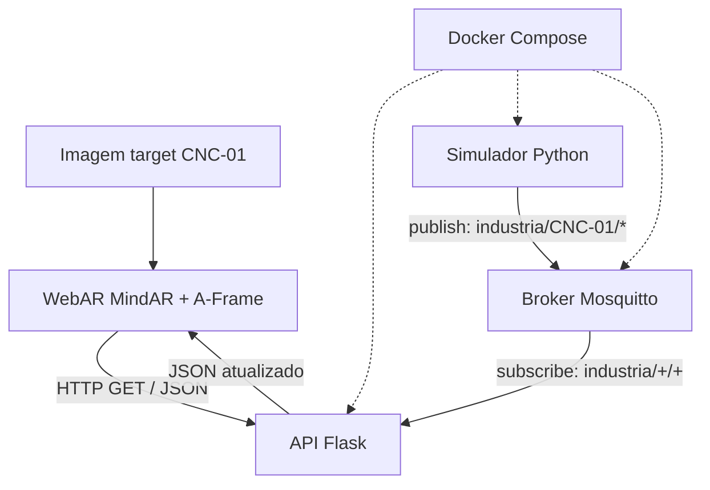

# Arquitetura do protótipo

```mermaid
flowchart TD
  A[Imagem target CNC-01] --> B[WebAR MindAR + A-Frame]
  B -->|HTTP GET / JSON| C[API Flask]
  D[Simulador Python] -->|publish: industria/CNC-01/*| E[Broker Mosquitto]
  E -->|subscribe: industria/+/+| C
  C -->|JSON atualizado| B
  F[Docker Compose] -.-> C
  F -.-> D
  F -.-> E
```

Para gerar `docs/arquitetura.png`, abra este Markdown em um visualizador Mermaid e exporte o diagrama como PNG.
